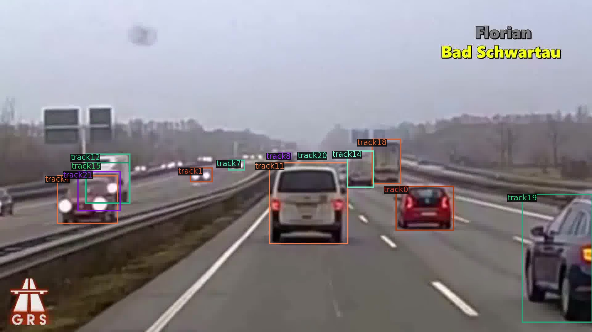

# Instance Segmentation, Pose Estimation and Object Tracking using Detectron2
> Explores detectron2 for object detections tasks.

[Detectron2](https://github.com/facebookresearch/detectron2) is an object detection library from Facebook AI. It can be used to perform;

- Instance segmentation
- Semantic segmentation
- Panoptic segmentation
- Object detection
- Object counting
- Pose estimation
- Object tracking
- etc

Any application that involves object detection can easily be performed using the detecton2 library. It has a good documentation.

## Projects

I explored the Detectron2 library as part of my project for [AMMI](https://aimsammi.org/) computer vision 2 course taught by [Georgia Gkioxari](https://gkioxari.github.io/) to perform some of the listed applications such as Instance segmentation, pose estimation, object detection, object tracking using my own dataset.

## Usage

Notebooks provided in this repository can be easily run on google colab. Upload the notebooks to colab to run.

You may need to add your own dataset.

## License

[MIT](https://choosealicense.com/licenses/mit/)